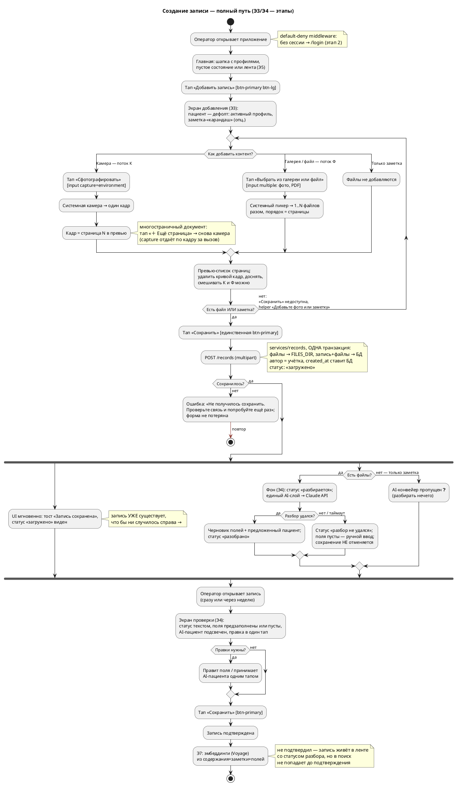
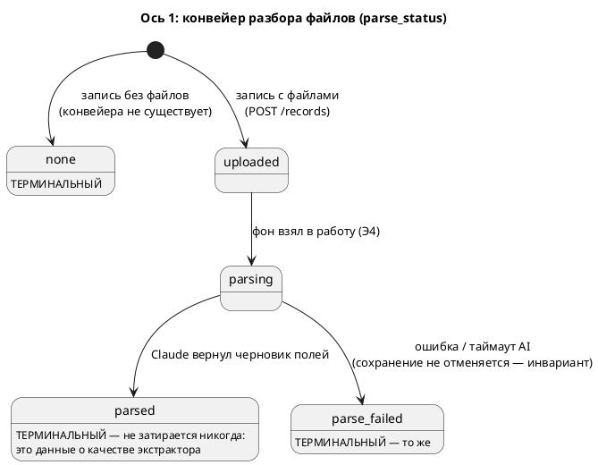

# Путь создания записи — полный, со всеми ветвлениями

> Аналитика перед нарезкой этапов 3–4 (и стыков с 5, 7). Источники: `OVERVIEW.MD` §5–§7, `DESIGN.MD`.
> Пометки: **Э3/Э4/Э5/Э7** — на каком этапе появляется элемент. ❓ — решение, которое надо принять при нарезке.

## 1. Персоны

| Персона | Роль в сценарии |
|---|---|
| **Оператор** (Дмитрий или Анастасия, учётка) | Единственный действующий актор: создаёт запись, правит поля, подтверждает. Автор записи — всегда его учётка (ADR-006) |
| **Пациент** (любой член семьи, вкл. Арину без учётки) | Объект записи, не актор. Дефолт — активный профиль из шапки |
| **AI-экстрактор** (Claude API, за сервисным слоем) | Асинхронный «помощник»: разбирает документ, предлагает поля и пациента. Никогда не блокирует и не отменяет сохранение |

## 2. Экраны и кнопки

| Экран | Элементы (примитивы кита) | Этап |
|---|---|---|
| **Главная** (лента/пустое состояние) | Шапка `app-head` (профили + выход) · **«Добавить запись»** — `btn-primary btn-lg`, единственная primary | кнопка Э3, лента Э5 |
| **Добавление записи** | **Два входа для контента** (см. §4а): **«Сфотографировать»** — `input capture="environment"`, открывает камеру, по одному кадру, цикл «＋ Ещё страница» · **«Выбрать из галереи или файл»** — `input multiple` (фото/PDF), мультивыбор одним заходом · общий превью-список страниц (порядок значим, можно удалить страницу до сохранения) · заметка `textarea.pencil` (карандаш) · пациент — выбор из членов семьи (монограммы/чипы), **дефолт — активный профиль** · **«Сохранить»** `btn-primary` · «Отмена» `btn-quiet` | Э3 |
| **Экран проверки** (он же режим правки, Э6) | Статус разбора текстом (всегда виден) · поля `field`: название, дата события (`control.data`, mono), клиника, врач, тип (`chip`, открытое), содержание · заметка-карандаш · пациент с подсветкой AI-предложения · **«Сохранить»** `btn-primary` | Э4 |
| **Карточка записи** | композиция `record`: head/meta/content/pencil-note/actions | Э5 |

Тексты по `DESIGN.MD` §5: имя действия сквозное («Сохранить» → тост «Запись сохранена»), ошибки говорят что делать, helper'ы объясняют, что AI подставит сам.

## 3. Хронология: что происходит в какой момент

| t | Событие | Компоненты |
|---|---|---|
| t₀ | Оператор на главной, тап «Добавить запись» | middleware (auth) → `routes/pages` |
| t₁ | Наполняет форму: файлы и/или заметка; пациент предвыбран | браузер (форма, camera из PWA) |
| t₂ | «Сохранить» → POST multipart | `routes/records` → **`services/records`**: инвариант «файл ИЛИ комментарий», **одна транзакция**: файлы → `FILES_DIR` (пути относительные), запись+файлы → БД; `автор` = учётка, `created_at` ставит БД; статус **«загружено»** |
| t₂+ε | Ответ мгновенно: redirect + тост «Запись сохранена». **Запись уже существует** — что бы ни случилось дальше | `routes/records` → UI |
| t₃ | Фон: статус **«разбирается»**; экстрактор читает файлы | фон-задача (Э4 ❓ механизм) → **единый AI-слой** `services/ai` → Claude API |
| t₄а | Разбор удался: черновик полей + предложенный пациент; статус **«разобрано»** | `services/ai` → `services/records` → БД |
| t₄б | Разбор упал/таймаут: статус **«разбор не удался»**, поля пусты. Запись живёт (инвариант) | то же |
| t₅ | Оператор открывает запись (сразу или через неделю), видит статус; UI статуса обновляется (Э4 ❓ polling/htmx) | `routes/records`, шаблон проверки |
| t₆ | Правит поля/пациента (или нет), «Сохранить» → запись **подтверждена** | `services/records` |
| t₇ | При подтверждении: эмбеддинги из содержание+комментарий+структурных полей | Э7: `services/embeddings` → Voyage AI |

## 4а. Два потока добавления контента — камера и файлы

Обе дороги сходятся в один превью-список и один `POST /records`; различие — до него.

**Поток К: камера (магистральный — жена у кабинета врача).**
1. Тап **«Сфотографировать»** → системная камера открывается сразу (`capture="environment"`, без галереи-посредника).
2. Снимок → кадр появляется в превью-списке как страница N.
3. Многостраничный документ: тап **«＋ Ещё страница»** → снова камера → страница N+1 (камера с `capture` отдаёт по одному кадру за вызов — цикл заложен в UI, а не оставлен на смекалку).
4. Кривой кадр — удалить страницу из превью, переснять.
- Особенности: формат кадра решает телефон (iOS — HEIC ❓ §7); на десктопе `capture` игнорируется и открывается обычный выбор файла — деградация приемлемая.

**Поток Ф: галерея / файлы (снял заранее или пришёл PDF).**
1. Тап **«Выбрать из галереи или файл»** → системный пикер (`multiple`, `accept: image/*, PDF`).
2. Мультивыбор: N фото одним заходом → страницы в порядке выбора; порядок можно поправить в превью ❓ (или пере-добавить — решение тикета Э3).
3. PDF — одним файлом, для AI он «многостраничный документ» сам по себе.
- Смешивание потоков допустимо: 2 кадра с камеры + 1 PDF из файлов — одна запись, единая нумерация страниц.

## 4б. Все ветвления

- **B1к. Камера** — главный путь жены: t₀…t₇ через поток К.
- **B1ф. Галерея/файл** — тот же t₀…t₇ через поток Ф.
- **B2. Файл + заметка** — как B1, заметка сразу в записи («карандаш»).
- **B3. Только заметка** (рост/вес, будущая прививка текстом) — файла нет. ❓ предлагаю: минует AI-конвейер, сразу «подтверждена» — разбирать нечего.
- **B4. Ни файла, ни заметки** — «Сохранить» недоступна + helper «Добавьте фото или заметку» (инвариант: пустых записей нет). Из тупика — добавить контент или «Отмена».
- **B5. Несколько страниц** — из камеры циклом, из пикера мультивыбором, можно смешивать; упорядоченная коллекция, AI трактует как один документ → один набор полей.
- **B6. Загрузка не удалась** (сеть/сервер) — ошибка говорит что делать («Не получилось сохранить. Проверьте связь и попробуйте ещё раз»), введённое не теряется, повтор. В БД и на диске — ничего (транзакция: вместе или никак).
- **B7. AI предложил другого пациента** — на проверке предложение подсвечено, принятие — один тап; выбранный при создании не затирается молча.
- **B8. AI не определил пациента / упал** — остаётся пациент, выбранный при создании (дефолт — активный профиль). Fallback по спеке = выбор человеком, он уже сделан.
- **B9. Оператор так и не открыл проверку** — запись живёт в ленте со статусом разбора; не подтверждена → эмбеддингов нет → в поиске (Э7) не участвует, в ленте — участвует.
- **B10. «Разбор не удался» → ручной ввод** — оператор заполняет поля сам на том же экране проверки и подтверждает. (Ретрай разбора кнопкой — ❓ бэклог/Could.)

## 5. Схема: activity (полный путь)

## 6. Статусная модель записи — две независимые оси (ADR-012)

> Обновлено 14.07.2026 (T3.5): один статус смешивал техническое состояние
> конвейера и продуктовый факт «человек проверил» — разделено на две оси.
> Полные правила — `docs/code/README.md` §«Статусная модель записи».

**Ось 1 — `parse_status`: что происходит с файлами (и только это).**

**Ось 2 — `confirmed_at`: посмотрел ли человек (NULL → момент подтверждения, одностороннее).**

- Запись **без файлов**: `confirmed_at = created_at` при создании — автор и есть проверяющий.
- Запись **с файлами**: NULL до «Сохранить» на экране проверки (Э4) — в любом терминальном статусе конвейера (`parsed` — принял черновик; `parse_failed` — заполнил руками).

**Следствия (правила потребителей):**

| Вопрос | Предикат |
|---|---|
| Что попадает в поиск (Э7)? | `confirmed_at IS NOT NULL` |
| Что предлагает экран проверки подтвердить? | `parse_status IN (parsed, parse_failed) AND confirmed_at IS NULL` |
| Какой статус показать в UI? | `confirmed_at` есть → «подтверждено»; иначе лейбл `parse_status` (для `none` — ничего) |
| В ленте (Э5) видно всё? | Да, в любом статусе (кроме soft-deleted) |

## 7. Решения, которые надо принять при нарезке (❓)

> **Статус:** ❓1–3 и ❓7–10 зафиксированы нарезкой этапа 3 (`tasks/TASK-3.md`, шапка). ❓4–6 — решаются при нарезке этапа 4.

1. **Запись без файла** — минует AI-конвейер и сразу «подтверждена»? (Рекомендую: да.)
2. **Куда ведёт redirect после сохранения на Э3**, пока нет ни карточки, ни ленты? (Рекомендую: главная + тост; карточка — Э5.)
3. **Пациент при создании** — дефолт «активный профиль», AI лишь предлагает замену на проверке? (Рекомендую: да — минимум трения, и B8 решается сам.)
4. **Механизм обновления статуса в UI** — htmx-polling? SSE? (Решение Э4.)
5. **Фон-исполнитель разбора** — BackgroundTasks FastAPI или отдельный воркер? (Решение Э4; для POC BackgroundTasks может хватить.)
6. **Ретрай разбора** при «не удался» — кнопка? (Предлагаю бэклог/Could.)
7. **Типы и размер файлов** (jpeg/png/heic/pdf, лимит МБ) и **схема хранения** в `FILES_DIR` (напр. `{record_id}/{position}.{ext}`) — тикеты Э3.
8. **HEIC с iPhone** — кадры камеры iOS приходят в HEIC: конвертировать на сервере в JPEG? принимать как есть (Claude vision его не ест — конвертация понадобится к Э4)? — тикет Э3/Э4.
9. **Сжатие фото на клиенте** до загрузки (кадр 12 Мп ≈ 3–5 МБ, клиника с плохой сетью): ужимать через canvas перед POST или грузить оригинал? Размен: JS-код против скорости и трафика. — тикет Э3, можно отложить в Could.
10. **Пере-упорядочивание страниц в превью** (drag) — или достаточно «удалить и добавить заново»? (Рекомендую второе — POC.)
