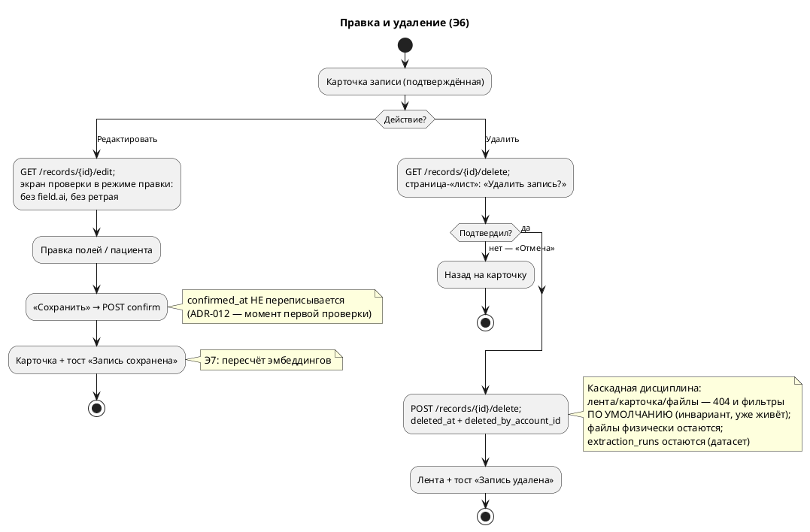

# Поток правки и удаления записи

> Аналитика перед нарезкой этапа 6. Источники: `OVERVIEW.MD` §5 («Мягкое удаление»), §6 «Редактирование»/«Удаление», §7 (активность 4), `DESIGN.MD` §4–§5 (rec-actions, модалка-«лист», правило «удаление всегда обособлено и с подтверждением»), ADR-012 (подтверждение одноразовое), кит v2 (`sheet-overlay`/`sheet-modal` — задел «с Э6»).
> Пометки: **Э6/Э7** — этап появления.
>
> **Утверждён владельцем 15.07.2026** — решения ❓1–7 (§8) приняты как записаны.

## 1. Суть

Этап 6 отдаёт записи под контроль человека: ошибку можно поправить, мусор — убрать. Спека (§6): редактирование — **тот же экран проверки в режиме правки** (один экран на два сценария); удаление — **soft delete с каскадной дисциплиной** и только после подтверждения. Ничего не стирается физически: `deleted_at` + `deleted_by_account_id`, файлы остаются на диске, но недоступны из UI.

## 2. Персоны

Один актор — **оператор** (любая учётка семьи: доверенное пространство, право на правку и удаление не ограничивается автором; кто удалил — фиксируется в `deleted_by_account_id`).

## 3. Экраны

| Экран | Элементы (примитивы кита) | Этап |
|---|---|---|
| **Карточка записи** (есть, Э5) | + `rec-actions` (композиция кита): **«Редактировать»** `btn-quiet` → режим правки · **«Удалить»** `btn-danger`, отодвинут вправо (`margin-left:auto`) → экран подтверждения | Э6 |
| **Экран проверки** (есть, Э4) | + **«Удалить»** `btn-danger` — обособленно, в конце формы перед `action-bar` (❓2: мусорный скан замечают именно на проверке) | Э6 |
| **Режим правки** (= экран проверки) | Тот же `records/record.html`: бейдж `done` «подтверждено», поля предзаполнены фактами, `field.ai`-кодов нет (запись уже проверена человеком — выводится из `confirmed_at`, само собой), «Разобрать ещё раз» скрыт (❓4) · «Сохранить» в `action-bar` · «Отмена» → назад на карточку | Э6 |
| **Подтверждение удаления** | Отдельная страница на «листе» кита (`sheet-modal`): заголовок «Удалить запись?», название/дата записи, пояснение, **«Удалить запись»** `btn-danger` + **«Отмена»** `btn-secondary` (❓1: страница, не JS-модалка — работает без JS, ADR-011) | Э6 |

## 4. Хронология

**Правка (подтверждённой записи):**

| t | Событие | Компоненты |
|---|---|---|
| t₀ | Карточка → тап «Редактировать» | `GET /records/{id}/edit` → `records/record.html` в режиме правки |
| t₁ | Правит поля / пациента; AI-кодов нет, ретрая нет | тот же шаблон; `ai_fields` пуст автоматически (confirmed) |
| t₂ | «Сохранить» → POST confirm | существующий `POST /records/{id}/confirm`: поля обновляются, **`confirmed_at` не переписывается** (ADR-012 — момент первой проверки историчен) |
| t₃ | Возврат **на карточку** записи + тост «Запись сохранена» (❓3) | redirect по скрытому полю режима правки |
| t₄ | Э7 (стык): правка подтверждённой → пересчёт эмбеддингов | обязательство этапа 7 |

**Удаление:**

| t | Событие | Компоненты |
|---|---|---|
| t₀ | Карточка (или экран проверки) → тап «Удалить» | `GET /records/{id}/delete` — страница подтверждения |
| t₁ | «Удалить запись» → POST | `POST /records/{id}/delete` → репозиторий: `deleted_at = now()`, `deleted_by_account_id = учётка оператора` |
| t₂ | Redirect на ленту + тост «Запись удалена» | лента уже не содержит запись (фильтр по умолчанию — инвариант) |
| t₃ | Прямые URL записи и её файлов → 404 | уже работает: `get_for_family` и файловый роут фильтруют `deleted_at` (T3.3/T5.3) |

## 5. Каскадная дисциплина удаления (что происходит с связанным)

| Сущность | Судьба | Механизм |
|---|---|---|
| Запись | скрыта отовсюду | `deleted_at`; **фильтр в репозитории по умолчанию** — инвариант, действует с Э5 |
| Файлы (`record_files`, диск) | строки и файлы остаются; из UI недоступны | файловый роут уже отдаёт 404 удалённым (T3.3) |
| `extraction_runs` | остаются навсегда | датасет качества экстрактора (ADR-013) — удаление записи его не портит |
| Эмбеддинги (Э7) | не попадают в поиск | выборка индексации фильтрует `deleted_at` по умолчанию + при удалении вычищается существующий вектор (обязательство Э7) |
| Восстановление | **Won't** (POC) | вручную в БД (`deleted_at = NULL`); UI не строим |

## 6. Ветвления

- **B1. «Отмена» на подтверждении удаления** — назад на карточку (или экран проверки, откуда пришли); запись не тронута.
- **B2. Удаление неподтверждённой** — с экрана проверки (случайный/мусорный скан): та же страница подтверждения, тот же POST.
- **B3. Запись уже удалена** (двойной сабмит, устаревшая вкладка) — `GET/POST` по удалённой → 404: `get_for_family` неразличимо фильтрует удалённые (существующее поведение).
- **B4. Правка не создаёт AI-иллюзий** — в режиме правки нет `field.ai` (запись проверена человеком) и нет «Разобрать ещё раз».
- **B5. Правка неподтверждённой** — это существующий экран проверки (Э4), без изменений; `GET /records/{id}/edit` для неподтверждённой не нужен — обычный `GET /records/{id}` и так ведёт на проверку (302 на канонический URL или тот же рендер — деталь тикета).
- **B6. Чужая запись** — `/edit`, `/delete` чужой/несуществующей → 404 неразличимо (паттерн T2.4).
- **B7. Пустая правка** — «Сохранить» без изменений безвреден: поля перезаписываются теми же значениями, `confirmed_at` не трогается.

## 7. Схема

## 8. Решения на утверждение (❓)

1. **Подтверждение удаления — отдельная страница**, свёрстанная «листом» кита (`sheet-modal`), а не JS-модалка: работает без JS (ADR-011), один код на все случаи. JS-оверлей поверх карточки — бэклог-улучшение, если страница будет ощущаться тяжёлой.
2. **«Удалить» есть и на экране проверки** — мусорный скан замечают именно там; кнопка обособлена (btn-danger в конце формы), подтверждение то же.
3. **Redirect после «Сохранить»**: из режима правки — **на карточку** (человек правил и хочет видеть результат); из первичной проверки — на ленту, как сейчас (сценарий «разобрал пачку подряд»). Реализация — скрытое поле формы.
4. **«Разобрать ещё раз» в режиме правки скрыт** — режим правки про человека, ретрай конвейера остаётся только на первичной проверке.
5. **Право на правку и удаление — у любой учётки семьи** (не только автора): доверенное пространство; `deleted_by_account_id` фиксирует, кто удалил.
6. **Тексты**: подтверждение — «Удалить запись?» + «Запись скроется из ленты и поиска.» + кнопки «Удалить запись»/«Отмена»; тост — «Запись удалена». (Деталь хэндоффа «файлы остаются на диске» в текст не тащим — внутренняя механика, пользователю не нужна.)
7. **Восстановление удалённых — Won't**: вручную в БД при нужде, UI не строим (спека §4).
