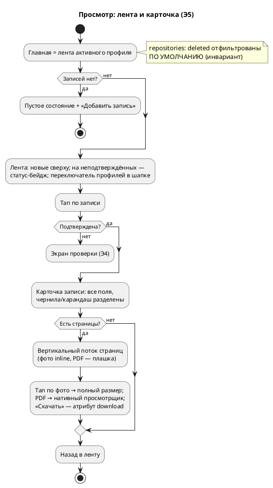

# Поток просмотра: лента и карточка записи

> Аналитика перед нарезкой этапа 5. Источники: `OVERVIEW.MD` §6 «Просмотр», §7 (активности 3–4), `DESIGN.MD` §4 (композиция `record`), ADR-012 (статусная модель).
> Пометки: **Э5/Э6** — этап появления. ❓ — решения на утверждение владельцем.

## 1. Суть

Этапы 3–4 научили продукт **копить**; этап 5 учит **отдавать**: «нужный факт можно достать хоть через минуту, хоть через год» — вторая половина стержневой проблемы. Лента по активному профилю заменяет временный счётчик и блок «Ждут проверки»; карточка записи даёт прочитать всё и пролистать страницы.

## 2. Персоны

Один актор — **оператор**. Ключевой сценарий метрики №2: жена у кабинета врача открывает продукт, переключается на Арину и за секунды находит нужную запись.

## 3. Экраны

| Экран | Элементы (примитивы кита) | Этап |
|---|---|---|
| **Лента** (главная, вместо счётчика) | Шапка `app-head` (есть) · «Добавить запись» `btn-primary btn-lg` (есть) · **переключатель сортировки**: «по внесению» (дефолт) / «по событию» — тихие ссылки (❓1) · список элементов-записей сверху вниз: композиция `record` в компактном виде — `rec-head` (название serif + дата mono), `rec-meta` (тип `chip`, клиника), **статус-бейдж на неподтверждённых** · пустое состояние (есть) | Э5 |
| **Карточка записи** (просмотр) | Полная композиция `record`: название + чип типа · даты (события и внесения, mono) · клиника/врач (`rec-meta`) · содержание (`rec-content`, чернила) · заметка (`pencil-note`, карандаш) · **страницы вертикальным потоком** (фото inline; PDF — плашка «открыть») · «Скачать оригинал» на каждой странице · статус текстом · `rec-actions`: «Редактировать» → экран проверки (кнопка появится в Э6) | Э5 |
| Экран проверки (есть, T4.4/T4.5) | Без изменений; остаётся входом для неподтверждённых записей | — |

## 4. Хронология

| t | Событие | Компоненты |
|---|---|---|
| t₀ | Главная = лента активного профиля (новые сверху) | `repositories/records.list_by_patient` — **фильтр soft delete по умолчанию (инвариант!)** |
| t₁ | Переключение монограммы → лента другого члена семьи | уже работает (T2.4/T2.5) |
| t₂ | Тап по элементу ленты | подтверждённая → **карточка**; неподтверждённая (`parsed`/`parse_failed`) → **экран проверки** (как сейчас из «Ждут проверки») |
| t₃ | Карточка: чтение полей; факты (чернила) и заметка (карандаш) визуально разделены | шаблон `records/view.html` |
| t₄ | Пролистывание: страницы-изображения идут вертикальным потоком — листание = естественный скролл | `GET /records/{id}/files/{pos}` (есть, T3.3) |
| t₅ | «Открыть/скачать оригинал»: фото — тап по странице (полный размер), PDF — нативный просмотрщик браузера; скачивание — атрибут `download` | без нового бэкенда |
| t₆ | Назад в ленту | — |

## 5. Ветвления

- **B1. Лента пуста** — существующее пустое состояние («{Имя} — записей пока нет» + кнопка).
- **B2. Запись не подтверждена** — элемент ленты несёт статус-бейдж («разобрано — проверьте» / «разбор не удался» / «разбирается»); тап ведёт на экран проверки, не на карточку.
- **B3. Многостраничная запись** — страницы вертикальным потоком в порядке `position`; счётчик «стр. N из M».
- **B4. PDF в записи** — inline-превью PDF на мобиле ненадёжно: плашка-страница «PDF · открыть» → нативный просмотрщик браузера (пролистывание из спеки покрывается им). Рендер PDF-превьюшек на лету — сознательно НЕ делаем (❓6).
- **B5. Запись без файлов** (заметка) — карточка без блока страниц; содержание/заметка как обычно.
- **B6. Удалённая запись** — в ленте не существует (репозиторий фильтрует по умолчанию); прямой URL — 404 (уже так, T3.3/T4.4).
- **B7. Файл пропал с диска** — страница-плашка «файл недоступен» вместо битой картинки; лог (паттерн T3.3).

## 6. Схема

## 7. Решения на утверждение (❓)

1. **Сортировка ленты — переключаемая** (решение владельца, 15.07.2026): «по внесению» (`created_at` desc, дефолт — хроника «что вносили») и «по событию» (`COALESCE(event_date, created_at)` desc — медицинская хронология; записи без даты события встают по дате внесения). Переключатель — две тихие ссылки над лентой, выбор в query-параметре (`?sort=event`).
2. **Блок «Ждут проверки» упраздняется** — его роль забирают статус-бейджи в ленте (неподтверждённые и так видны, тап ведёт на проверку). Один список вместо двух.
3. **Элемент ленты**: название (или «Запись без названия») + дата события (или внесения, если событийной нет) mono + чип типа + клиника + статус-бейдж для неподтверждённых. Без сниппета содержания — лента компактная, телефонная.
4. **Листание страниц — вертикальный поток** (естественный скролл, ноль JS, тач-френдли), не карусель/свайп. Тап по странице — оригинал в полный размер (новая вкладка).
5. **Скачивание** — `<a download>` на существующий файловый роут; отдельного endpoint не нужно.
6. **PDF — без серверного рендера превью**: плашка → нативный просмотрщик. Рендер страниц PDF в PNG на лету (pypdfium2 есть) — отложен до реальной боли (бэклог).
7. **Без пагинации в Э5**: у семьи за обкатку — десятки записей, «показать ещё» — преждевременно (бэклог при реальной боли).
8. **Карточка read-only**: «Редактировать»/«Удалить» — этап 6 (спека); в Э5 кнопок нет, редактирование неподтверждённых доступно через экран проверки как сейчас.
