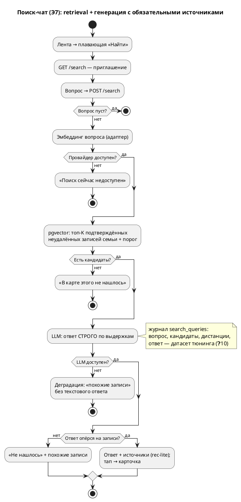

# Поток поиска: чат «вопрос → ответ с источниками»

> Аналитика перед нарезкой этапа 7. Источники: `OVERVIEW.MD` §4 («AI-поиск — строго retrieval»), §6 «Поиск», §7 (активность 3), ADR-012 (в поиске только подтверждённое), ADR-013/014 (паттерн AI-адаптера, агрегатор), обязательства потоков Э5/Э6.
> **Утверждён владельцем 19.07.2026 целиком** — решения ❓1–10 приняты как записаны в §7.

## 1. Суть

Вторая половина стержневой проблемы: «нужный факт можно достать хоть через год». **Поиск — это чат** (решение ❓2): жена спрашивает своими словами — «когда Арине делали манту?» — и получает **текстовый ответ, собранный строго из записей карты, с обязательными ссылками на записи-источники** под ответом. Ответ без источников не существует: нет опоры в записях — честное «в карте этого не нашлось».

Строго retrieval (спека §4): модель отвечает только фактами из найденных записей — извлекает и цитирует, не интерпретирует и не советует (принцип продукта). Цепочка: вопрос → эмбеддинг → pgvector топ-K → LLM формулирует ответ по выдержкам → ответ + источники.

## 2. Персоны

Один актор — **оператор**. Сценарий: у кабинета врача листать некогда — вопрос в чат, тап по источнику, показать карточку врачу.

## 3. Экраны

| Экран | Элементы (примитивы кита) | Этап |
|---|---|---|
| **Поиск-чат** (`/search`) | Чат-лента: реплики оператора и ответы системы; под каждым ответом — блок «Источники»: 1..K записей как `rec-lite` (название, дата, чип, клиника, **монограмма/имя пациента** — поиск семейный, ❓3) · поле ввода вопроса + «Спросить» — закреплены снизу (`action-bar`-семейство) · пустое состояние-приглашение («Спросите своими словами — например, „когда Арине делали манту?"») | Э7 |
| **Лента** (есть) | + **плавающая кнопка «Найти»** (❓4): «летит» над записями справа снизу, выше `action-bar`, компактная; не перекрывает контент; новый примитив через §8 | Э7 |

## 4. Хронология

| t | Событие | Компоненты |
|---|---|---|
| t₀ | Тап по плавающей «Найти» → чат с приглашением | `GET /search` |
| t₁ | Вопрос словами → «Спросить» | `POST /search` (вопрос + видимая история — см. ❓8) |
| t₂ | Вопрос → эмбеддинг | `services/embeddings` (адаптер ❓1: RouterAI, Protocol + фабрика, конфиг `EMBEDDINGS_*`) |
| t₃ | pgvector: топ-K ближайших среди **подтверждённых неудалённых** записей семьи + порог (❓6) | `repositories/embeddings` — фильтры по умолчанию |
| t₄ | Выдержки топ-K → LLM: «ответь строго по этим записям; не хватает — скажи, что не нашлось» | `services/search_chat` → LLM-адаптер (тот же RouterAI, модель экстрактора) |
| t₅ | Ответ + источники (ровно те записи, на которые ответ опёрся) в чат-ленту; тап по источнику → карточка | шаблон `search.html` |
| t₆ | Каждый вопрос-ответ — строка журнала поиска (❓10: датасет тюнинга) | `search_queries` |

**Индексация (фоном, вне экрана):**

| Момент | Что происходит |
|---|---|
| Подтверждение записи (первичное и правка) | фоном: текст записи → эмбеддинг → upsert в `record_embeddings`; провал не блокирует подтверждение (B7) |
| Удаление записи | строка эмбеддинга удаляется в `soft_delete`; поиск в любом случае join'ит записи с фильтрами по умолчанию |
| Деплой этапа / смена модели | бэкфилл-переиндексация: `uv run python -m app.tools.reindex` (идемпотентен) |

**Индексируемый текст** (❓5 — все поля): имя пациента + название + тип + клиника + врач + дата события + содержание + комментарий. Только подтверждённые записи (ADR-012).

## 5. Ветвления

- **B1. Пустой/пробельный вопрос** — чат как был, провайдеры не дёргаются.
- **B2. Ничего выше порога** — ответ «В карте этого не нашлось. Попробуйте спросить другими словами.» без обращения к LLM (нечего подавать — нечего сочинять).
- **B3. Эмбеддинг-провайдер недоступен** — реплика «Поиск сейчас недоступен. Попробуйте позже.»; остальной продукт живёт.
- **B4. LLM недоступен (retrieval сработал)** — деградация без вранья: «Ответ сейчас не собрать, но вот записи, похожие на ваш вопрос» + список источников. Retrieval-ядро автономно.
- **B5. LLM не нашёл ответа в выдержках** — модель обязана сказать «не нашлось» (промпт-контракт); источники в этом случае не показываются как «ответ», но список «похожие записи» остаётся — вдруг нужное там.
- **B6. Ответ без привязки к источникам** — запрещён по построению: в чат уходит только ответ, сопровождённый ≥1 источником, иначе ветка B5.
- **B7. Провал индексации при подтверждении** — подтверждение состоялось; warning-лог; запись доиндексируется бэкфиллом или следующей правкой.
- **B8. Результат другого профиля** — норма (❓3): у источника видно, чей он; тап не переключает активный профиль.

## 6. Схема

## 7. Решения

**Приняты владельцем 19.07.2026:**

1. **Эмбеддинги — RouterAI** (изменение стека: Voyage недоступен по оплате, прецедент ADR-014). Слой — Protocol + адаптер + фабрика (паттерн ADR-013), конфиг `EMBEDDINGS_*`; модель и размерность фиксируются ADR'ом при нарезке.
2. **Поиск — чат с генеративным ответом уже в Э7**; источники под ответом обязательны, ответ без источников не существует.
3. **Поиск семейный**, не по активному профилю; принадлежность видна в каждом источнике.
4. **Вход — плавающая кнопка «Найти»** над записями (низ экрана, компактная), не в шапке.
5. **Индексируются все поля** записи + имя пациента.
6. **Порог и K — конфиг** (`SEARCH_*`), стартово K=5; тюнинг на реальных данных.
7. **Хранение — отдельная таблица `record_embeddings`** (вектор + имя модели + момент расчёта): смена модели без миграции основной таблицы, переиндексация штатным инструментом. Требование владельца: поиск должен быть максимально точным, после POC — тюнинг; архитектура это закладывает (см. ❓10 и `reindex`).

**Детализация чата (приняты 19.07.2026):**

8. **Каждый вопрос самостоятелен**: retrieval и ответ строятся по последнему вопросу, диалоговый контекст («а когда это было?» про прошлый ответ) в Э7 не поддерживается — многоходовость взрывает сложность и риск галлюцинаций. История на экране — просто лента прошлых Q&A текущей сессии (браузерной), в БД не хранится.
9. **Генерация — той же моделью, что экстрактор** (`anthropic/claude-sonnet-5` через RouterAI, тот же ключ): один провайдер, один биллинг; отдельный конфиг не заводим, пока не понадобился.
10. **Журнал поиска `search_queries`** (вопрос, id и дистанции кандидатов, ответ, момент) — датасет для обещанного тюнинга, аналог `extraction_runs`: без него «тюнить историю» после POC будет не на чем. В UI не показывается.
