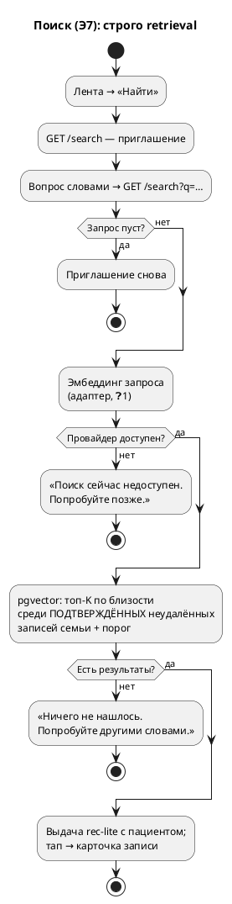

# Поток поиска: вопрос словами → записи-источники

> Аналитика перед нарезкой этапа 7. Источники: `OVERVIEW.MD` §4 («AI-поиск — строго retrieval»), §6 «Поиск», §7 (активность 3), ADR-012 (в поиске только подтверждённое), ADR-013/014 (паттерн AI-адаптера и агрегатор), обязательства из потоков Э5/Э6 (индексация при подтверждении, пересчёт при правке, чистка при удалении).
> Пометки: ❓ — решения на утверждение владельцем.

## 1. Суть

Вторая половина стержневой проблемы целиком: «нужный факт можно достать хоть через год». Жена у кабинета врача спрашивает своими словами — «когда Арине делали манту», «что там было с гемоглобином» — и получает **записи-источники**, а не пересказ. Поиск векторный (смысл, не подстрока): «прививка от кори» найдёт запись со словом «вакцинация ККП».

Строго retrieval (спека §4): система **извлекает и показывает существующее**, ничего не сочиняет. В POC-этапе выдача — список записей со ссылками (❓2: без генеративного текстового ответа).

## 2. Персоны

Один актор — **оператор**. Сценарий метрики №2 — тот же, что у ленты, но когда листать долго: вопрос → тап по результату → карточка → показать врачу.

## 3. Экраны

| Экран | Элементы (примитивы кита) | Этап |
|---|---|---|
| **Поиск** (`/search`) | Строка запроса (`field`/`control` + кнопка «Найти» — примитив поисковой формы через §8) · выдача — список `rec-lite` (как лента: название, дата, чип, клиника, **+ монограмма/имя пациента** — поиск семейный, ❓3) · пустое состояние до запроса («Спросите своими словами — например, „когда Арине делали манту"») · честное «не нашёл» («По этому вопросу ничего не нашлось. Попробуйте другими словами.») | Э7 |
| **Лента** (есть) | + вход в поиск: тихая ссылка/иконка «Найти» в `feed-head` рядом с сортировкой (❓4) | Э7 |

## 4. Хронология

| t | Событие | Компоненты |
|---|---|---|
| t₀ | Тап «Найти» на главной → экран поиска (пустое состояние-приглашение) | `GET /search` |
| t₁ | Оператор вводит вопрос словами, «Найти» | `GET /search?q=…` (GET — запрос шарится ссылкой, back-навигация живёт) |
| t₂ | Запрос → эмбеддинг (провайдер за адаптером, ❓1) | `services/embeddings` (паттерн ADR-013: Protocol + фабрика + конфиг) |
| t₃ | pgvector: топ-K ближайших **среди подтверждённых неудалённых** записей семьи, отсечка по порогу (❓6) | `repositories/embeddings` — фильтры по умолчанию, как везде |
| t₄ | Выдача: записи по убыванию близости; тап → карточка (или экран проверки — ветвление t₂ Э5 как есть) | шаблон `search.html` |
| t₅ | Ничего выше порога → честное «не нашёл», без выдумок | то же |

**Индексация (фоном, вне экрана):**

| Момент | Что происходит |
|---|---|
| Подтверждение записи (confirm, первичное) | фоном: текст записи → эмбеддинг → upsert в `record_embeddings`. Провал — не блокирует подтверждение (лог + запись просто не ищется, до переиндексации) |
| Правка подтверждённой (confirm повторный) | то же — пересчёт (обязательство Э6) |
| Удаление записи | строка эмбеддинга удаляется в `soft_delete` (вектор — производная, не данные); поиск в любом случае join'ит записи с фильтрами по умолчанию — двойная защита |
| Деплой этапа | разовый бэкфилл существующих подтверждённых записей: `uv run python -m app.tools.reindex` (идемпотентен, пригоден и для смены модели) |

**Индексируемый текст** — одна строка на запись: имя пациента + название + тип + клиника + врач + дата события + содержание + комментарий (❓5). Только подтверждённые (ADR-012: черновикам AI в поиске не место).

## 5. Ветвления

- **B1. Пустой/пробельный запрос** — экран поиска с приглашением, провайдер не дёргается.
- **B2. Ничего выше порога** — «не нашёл» честно; никакого «ближайшего похожего» ниже порога (лучше пусто, чем враньё — риск доверия).
- **B3. Провайдер эмбеддингов недоступен** — «Поиск сейчас недоступен. Попробуйте позже.» (текст говорит, что делать; не 500); лента и всё остальное живут — поиск деградирует изолированно.
- **B4. Найдена неподтверждённая** — невозможно: в индексе только подтверждённые (и при ретрае конвейера после подтверждения запись из индекса не выпадает — confirm единственный триггер).
- **B5. Найдена удалённая** — невозможно: вектор удалён + join с репозиторным фильтром.
- **B6. Результат из другого профиля** — норма (❓3): поиск семейный, у результата видно, чей он; тап ведёт на карточку без переключения активного профиля.
- **B7. Провал индексации при подтверждении** — подтверждение состоялось (ничто не блокирует сохранение); лог warning; запись доиндексируется бэкфиллом/следующей правкой.

## 6. Схема

## 7. Решения на утверждение (❓)

1. **Провайдер эмбеддингов — RouterAI** (тот же OpenAI-совместимый API, `/embeddings`), а не Voyage из зафиксированного стека: Voyage не оплатить из региона владельца — ровно та же ситуация, что с Anthropic API (прецедент ADR-014, embeddings-модели в каталоге RouterAI есть). Слой — по паттерну ADR-013: Protocol + адаптер + фабрика, конфиг `EMBEDDINGS_*`; конкретная модель — деталь тикета (выбрать из каталога, зафиксировать в ADR вместе с размерностью). **Это изменение стека — требует вашего явного «да».**
2. **Выдача этапа 7 — список записей-источников** (retrieval в чистом виде), без генеративного текстового ответа. Текстовый ответ с цитатой и ссылкой («ответ по карте») — отдельная надстройка над тем же retrieval: предлагаю в бэклог, добавим после обкатки поиска, если списка окажется мало.
3. **Поиск — по всей семье**, не по активному профилю: вопрос «когда Арине делали манту» задают с любого профиля. Имя пациента — в индексируемом тексте и в каждом результате.
4. **Вход в поиск** — тихая ссылка «Найти» в шапке ленты (`feed-head`, рядом с сортировкой); отдельный экран `/search`, запрос в `?q=` (шарится ссылкой).
5. **Индексируемый текст** — конкатенация: пациент, название, тип, клиника, врач, дата события, содержание, комментарий. Комментарий индексируется (спека §5: «индексируется для поиска»).
6. **Порог «не нашёл» и K** — конфиг (`SEARCH_*`), стартовые значения подбираются на реальных данных при обкатке; K=5.
7. **Хранение** — отдельная таблица `record_embeddings` (запись 1:1, вектор, имя модели, момент расчёта): смена модели = переиндексация без миграции `health_records`; расширение pgvector включается миграцией этапа.
